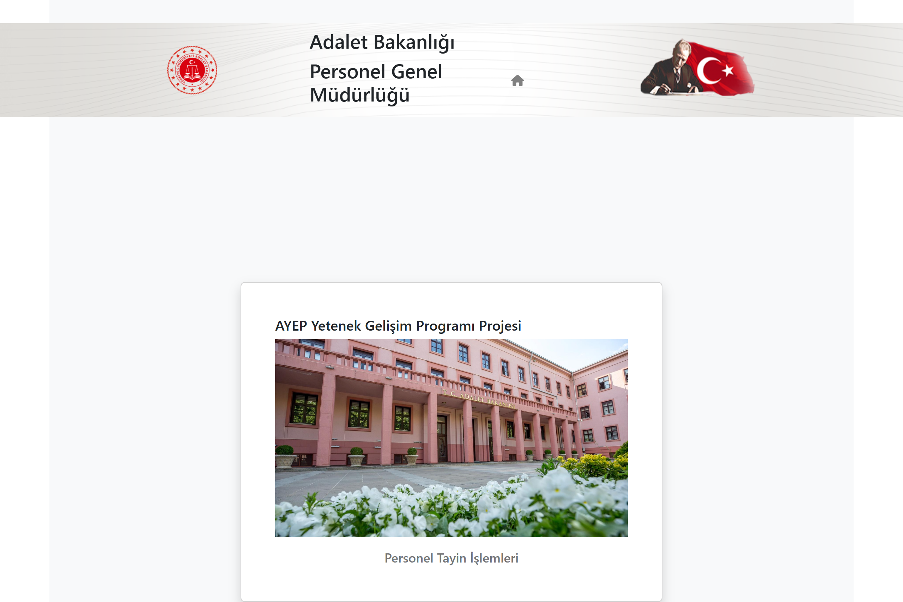

# Adalet Bakanlığı Tayin Sistemi

Bu proje, Adalet Bakanlığı personelinin tayin işlemlerini yönetmek için geliştirilmiş bir web uygulamasıdır.



## Özellikler

- 🔐 Güvenli Kullanıcı Girişi
  - Kurum sicil numarası ve şifre ile giriş
  - Oturum yönetimi ve güvenlik kontrolleri
  - Tarayıcı kapatıldığında otomatik çıkış

- 👤 Kullanıcı Paneli
  - Kişisel bilgileri görüntüleme
  - Tayin talebi oluşturma (en fazla 5 tercih)
  - Mevcut tayin taleplerini görüntüleme
  - Tayin puanı ve hizmet yılı bilgisi

- 👨‍💼 Admin Paneli
  - Tüm kullanıcıları listeleme
  - Kullanıcı bilgilerini düzenleme
  - Tayin taleplerini görüntüleme
  - Tayin geçmişini inceleme
  - Kullanıcı silme

## Kullanım Kılavuzu

### Giriş Yapma
1. Ana sayfada "Personel Tayin İşlemleri" linkine tıklayın
2. Kurum sicil numaranızı girin (ab ile başlamalı, 8 karakter)
3. Şifrenizi girin (en az 8 karakter, büyük/küçük harf, rakam ve özel karakter içermeli)

### Kullanıcı İşlemleri
1. Giriş yaptıktan sonra kullanıcı bilgilerinizi görebilirsiniz
2. Sol menüden "Tayin Talebi" seçeneğine tıklayarak yeni tayin talebi oluşturabilirsiniz
3. Tayin talebinde:
   - İl seçimi yapın
   - İlçe seçimi yapın
   - Adliye seçimi yapın (en fazla 5 tercih)
4. Sağ üstteki simgeler:
   - 🏠 Ana sayfa
   - 👤 Kullanıcı paneli
   - 🚪 Çıkış

### Admin İşlemleri
1. Admin girişi yapıldığında admin paneline yönlendirilirsiniz
2. Panelde:
   - Tüm kullanıcıların listesi
   - Her kullanıcı için düzenleme ve silme seçenekleri
   - Tayin taleplerini görüntüleme
   - Tayin geçmişini inceleme

## Güvenlik Özellikleri

- Oturum Yönetimi:
  - Tarayıcı kapatıldığında otomatik çıkış
  - 2 saat sonra otomatik oturum sonlandırma
  - URL manipülasyonlarına karşı koruma
  - Yetkisiz sayfa erişimlerine karşı koruma

- Şifre Politikası:
  - Minimum 8 karakter
  - En az 1 büyük harf
  - En az 1 küçük harf
  - En az 1 rakam
  - En az 1 özel karakter

## Teknik Gereksinimler

- Node.js
- Vue.js 3
- Modern bir web tarayıcısı (Chrome, Firefox, Safari, Edge)

## Kurulum

1. Projeyi klonlayın:
```bash
git clone [proje-url]
```

2. Bağımlılıkları yükleyin:
```bash

npm install
```

3. Geliştirme sunucusunu başlatın:
```bash
    ## server çalıştırmak için: 
cd server
npm start

    ## server çalıştırmak için: 
cd ABTayin
yarn dev    ## veya => npm run dev 


```

4. Tarayıcıda açın:
```
http://localhost:5173
```

## Test Kullanıcıları

1. Admin Kullanıcısı:
   - Sicil: ab000000
   - Şifre: Admin2025*

2. Normal Kullanıcılar:
   - Sicil: ab111111
   - Şifre: Admin2025* 

   - Sicil: ab222222
   - Şifre: Admin2025* 

   - Sicil: ab333333
   - Şifre: Admin2025* 